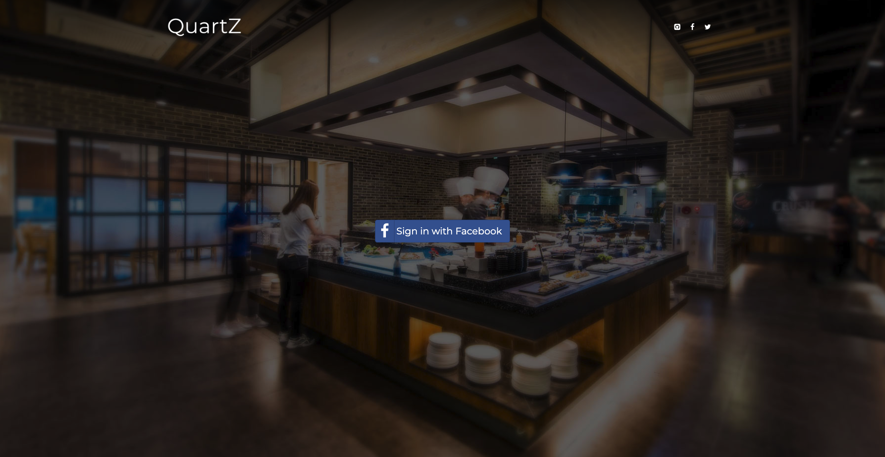
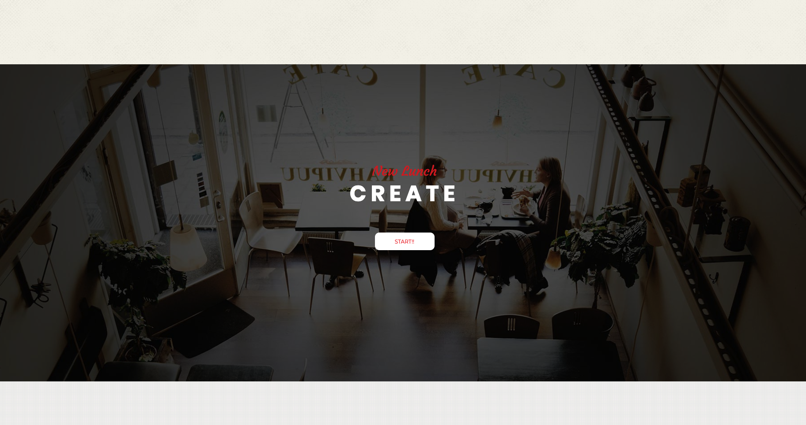
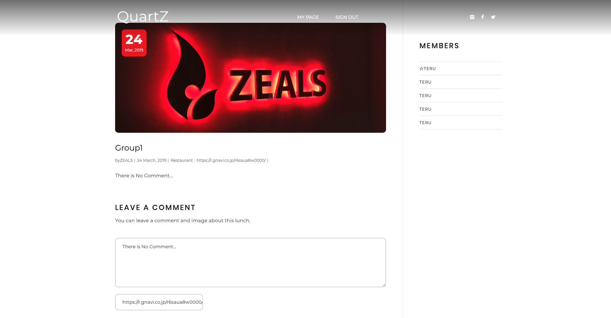
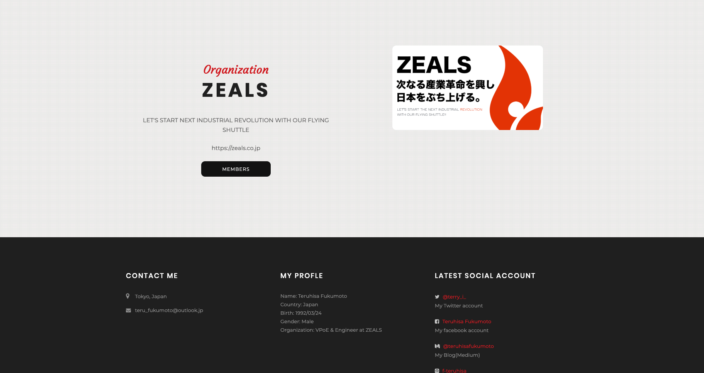

QuartZ
====

# Description
- QuartZ solves communication challenges in your organization with random lunch.
- “Random lunch” is a method of activating communication inside the company.

# What is Random lunch??
- Random lunch is a method of randomly creating a group from team members and performing lunch in that group. 
- Doing so promotes communication with members who are usually not involved.

# How to use??
## Sign out / Sign in

- Sign in or Sign up using facebook authentication

## Create Groups & Lunch

- Create a launch group in your organization

## Record memories of lunch

- Record your lunch memories using images, comments, and the URL of the restaurant you went to

## Registration your organization

- It is possible to create a new organization and invite users

# Dependency
- Ruby
- Rails
- devise
- bootstrap
- MySQL

# Contribution
- Commit your changes (git commit -am 'Update enviroment')

# Template for bootstrap
- Template:[Pato](https://colorlib.com/wp/template/pato/)
- Author: Colorlib
- Licence: CC BY 3.0

# Author
- Teruhisa Fukumoto([f-teruhisa](https://github.com/f-teruhisa))
